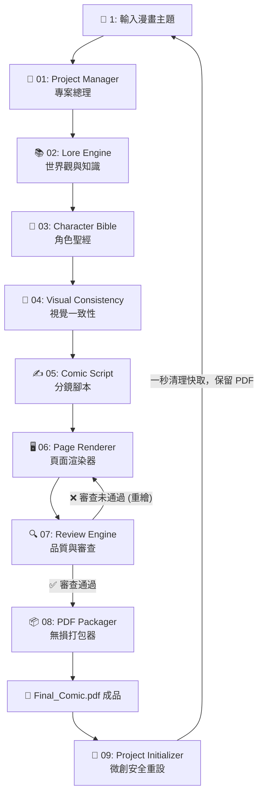

# 📖 AI 漫畫生成器：系統概覽與開發手冊 (System Overview & User Manual)

[](https://opensource.org/licenses/MIT)
[](https://obsidian.md/)
[](#)

> [!IMPORTANT] 專案總控核心與 IDE 哲學
> 本文件是整個「AI 漫畫生成器」的 **「專案聖經（Project Bible）」**。為了徹底解決長篇漫畫中常見的 **「角色臉部漂移（Character Drift）」**、**「世界觀前後崩壞」** 以及 **「科普知識太像有插圖的 PPT（無趣課本）」** 三大死穴，本系統阻絕了單一的超長提示詞，而是採用由 **1 個專案聖經指導**、**7 個獨立子引擎** 與 **2 大自動化公用程式** 構成的「狀態機 + 階段式 Pipeline」開發環境。
> 
> 本指南將作為您手動修改與 AI 代理自動化生成的最高指導原則與使用手冊。

---

## 🧠 第一部分：系統設計概覽 (System Architecture)

本系統以「AI 漫畫 IDE（整合開發環境）」為設計理念，透過分離「腳本／邏輯模型」與「生圖模型」，讓各個專業子引擎在不同階段發揮極致效能，並依賴結構化的永久記憶（Persistent Memory）確保一致性。

### 1. 核心開發套件與模組架構
系統共劃分為 7 大核心引擎與 2 大自動化腳本工具，彼此環環相扣：



### 2. 為什麼需要分離「邏輯」與「生圖」？
*   **單一 Prompt 崩潰防範**：若讓同一個生圖 Prompt 同時承載劇情、分鏡、美術風格、角色外貌與知識定義，會嚴重超出擴算模型的注意力限制。
*   **階段式遞進**：Lore Model 專注於理論架構，Script Model 專注於電影級鏡頭語言，Art Director 專注於提示詞工程，而 Image Model（如 Nano Banana 2）則純粹負責高畫質圖像渲染。

---

## 🗺️ 第二部分：四大核心專案聖經資料結構 (Persistent Memory)

在啟動專案時，系統會建立以下四大結構化資料庫作為永久記憶。AI 代理在後續的腳本編寫與生圖渲染中，必須隨時讀取並絕對服從這些定義：

### 🧭 1. 世界聖經 (World Bible)
確保世界觀在 100 頁的篇幅中不會發生技術演化錯置（如在蒸氣龐克世界中突然出現現代量子 AI 航母）。
```json
{
  "worldName": "世界觀與文明名稱",
  "timeline": ["關鍵歷史或科學發展時間線"],
  "technologyLevel": "文明與技術等級（設定嚴密界線）",
  "politicalFactions": ["政權/學院/宗教勢力名稱"],
  "energySystem": "底層能源運作物理規則",
  "visualKeywords": ["視覺核心風格關鍵詞，例如 brass gears, glowing amber pipes"],
  "forbiddenElements": ["嚴格禁止出現的超時代或風格錯置元素"]
}
```

### 👥 2. 角色聖經 (Character Bible)
鎖定角色核心人設，這是克服「角色漂移」的第一道防線。
```json
{
  "name": "角色姓名",
  "age": "年齡與外觀年齡特徵",
  "appearance": "臉型、髮型幾何、五官細節描繪",
  "silhouette": "剪影特徵（只看黑影也能一秒識別的招牌特徵，如蝙蝠耳、高禮帽）",
  "personality": "性格特徵與標誌性小習慣（如思考時撫摸單片眼鏡）",
  "speechStyle": "說話口氣、口頭禪或說話限制",
  "costumeRules": ["衣服層次、固定配飾、不可變更的服裝細節"],
  "colorPalette": ["專屬角色代表色 HEX 矩陣"],
  "relationships": [{"name": "關係人", "vibe": "情感衝突/同盟/宿敵"}],
  "arcProgression": ["角色在故事中的心理與年齡成長弧線階段"]
}
```

### 🧠 3. 知識聖經 (Knowledge Bible)
防止科普知識在前後頁面定義不一，或流於枯燥的論文式碎念。
```json
{
  "term": "科學理論或歷史術語",
  "definition": "極度淺顯易懂、口語化且無論文口吻的解釋",
  "visualMetaphor": "視覺化比喻（如用『拉扯的床單』來比喻重力造成的時空彎曲）",
  "relatedConcepts": ["關聯理論或術語"],
  "ruleMapping": "概念世界化物理規則（將抽象術語直接對應為世界觀規則，詳見下文說明）"
}
```

### 🎨 4. 美術指導聖經 (Art Direction Bible)
固定整本漫畫的視覺調性，防止前後頁面美術風格割裂。
```json
{
  "style": "鎖定的漫畫風格（日漫/美漫/中國水墨/童話繪本等）",
  "lineWeight": "線條粗細與筆觸質感",
  "lightingStyle": "光影基調（如 warm nostalgia, oppressive industrial lighting）",
  "cameraLanguage": "電影級鏡頭偏好（如 dutch angle, bird's eye view）",
  "panelDensity": "每頁分鏡格子密度限制（嚴格限制在 3-6 格）",
  "colorTemperature": "主色調與冷暖色溫控制參數"
}
```

---

## 🎭 第三部分：高級概念敘事：規則對應與戲劇引擎

科普與歷史漫畫最忌諱流於「有插圖的課本」。本系統藉由以下兩大機制，將生硬的知識轉化為有血有肉的敘事史詩：

### 🧪 1. 規則對應 (Rule Mapping)
拒絕簡單的將科學家畫成帥哥，或將量子力學畫成魔法少女。我們必須將抽象概念**映射為世界觀底層的物理與社會規則**，讓角色在生存與冒險中體現理論：

| 抽象概念 (Term) | ❌ 傳統擬人化做法 | 🎨 高級的「規則對應 (Rule Mapping)」做法 |
| :--- | :--- | :--- |
| **熵增定律 (Entropy)** | 畫一個叫「熵」的惡魔少女在破壞城市。 | 設定世界觀為 **「熵增之沙」**：任何不持續投入生命能量的城市與記憶，都會發生不可逆的物理沙化與碎裂。角色必須不斷冒險尋求熵減之源。 |
| **廣義相對論 (Relativity)** | 畫愛因斯坦在實驗室一邊吃拉麵一邊解釋重力。 | 設定世界觀為 **「重力時間階級」**：重力場極強的底層貧民窟時間流速極快，平民衰老迅速；上層貴族居住在微重力浮島，時間流速極慢，能冷眼俯瞰底層數代人的生死。 |
| **文明演化 (Evolution)** | 一頁內畫滿傳統猿人變成太空人的插圖。 | 將其設計為 **「科技遺物禁忌」**：主角在蒸汽龐克世界中挖掘出「矽晶片印記」，引發神權學院對文明加速演化的扼殺與追捕。 |

### 🎭 2. 戲劇引擎 (Drama Engine)
腳本分鏡必須強制融入以下五大戲劇張力元素：
1.  **懸念 (Mystery)**：世界底層未知的知識漏洞、歷史陰謀或物理危機。
2.  **衝突 (Conflict)**：角色之間、或是文明主體與無情物理法則之間的直接對立。
3.  **代價 (Cost)**：為突破歷史局限、獲得真理或解決世界所必須做出的重大個人犧牲。
4.  **真相揭露 (Revelation)**：理論瓶頸突破、歷史面紗被揭開的震撼視覺瞬間。
5.  **角色改變 (Transformation)**：經歷知識或歷史重塑後，主角心靈弧線的蛻變與思想昇華。

---

## 👥 第四部分：角色一致性與視覺設定特徵

AI 漫畫的核心護城河在於「不漂移的畫面」。我們使用以下三大規範來鎖定角色視覺：

### 1. 輪廓識別（Silhouette Identity）
一個成功的漫畫角色，必須做到「**只看黑影也能一秒識別**」。
*   設計師與生圖引擎在建立 Prompt 時，必須為角色加入標誌性的剪影元素（例如：不對稱的巨大髮飾、特製的高領披風、招牌單片眼鏡、或是特殊的帽子形狀）。

### 2. 表情與姿勢多維矩陣
為了防止 AI 在每一頁生成一模一樣的撲克臉或僵硬姿勢，角色聖經中必須包含：
*   **表情庫（Expression Library）**：憤怒、冷笑、哭泣、驚恐、思考、崩潰、狂喜。
*   **姿勢庫（Pose Library）**：招牌站姿、習慣性防衛手勢、戰鬥姿勢、思考時的經典小動作。

### 3. 專業角色設定圖 (Character Design Sheet) 生成標準
當 Visual Consistency Engine 生成設定圖時，輸出的生圖 Prompt 必須採用工業級 Concept Art 規格，強制包含以下結構：
*   **Turnaround Layout**：`character sheet, front view, side profile, back view, full body turnaround, white grid background`
*   **表情與演化**：`expression study (neutral, angry, smirk, crying), age progression (youth, adult, elderly)`
*   **服飾與材質細節**：`costume breakdown, accessory close-up swatches, layered clothing, high consistent character identity, studio quality concept art`
*   **畫質控制**：`ultra detailed, polished linework, cinematic lighting, highly consistent, orthographic layout`

---

## 📖 第五部分：使用手冊與逐步工作流 (User Manual)

本手冊引導您如何一步步從零開始，透過 10 大 Skills 模組，完成一部高品質漫畫的開發。

```
[專案初始化] -> [步驟 1: 世界觀建構] -> [步驟 2: 角色設計] -> [步驟 3: 設定圖繪製] 
              -> [步驟 4: 分鏡腳本] -> [步驟 5: 頁面渲染] -> [步驟 6: 審查與修復] -> [步驟 7: 打包 PDF]
```

### 🧹 步驟 0：開發環境初始化 (Project Initializer)
*   **使用時機**：當您要開始全新的漫畫主題，且已將上一部漫畫打包 PDF 存檔時。
*   **操作指令**：對 AI 說：**「運行 Project Initializer，重設專案環境以開啟新主題」**。
*   **底層動作**：系統會執行 `Scripts/init_project.sh`，讀取 `config.json` 中的儲存路徑，直接安全刪除整個 `Working/` 暫存工作區目錄及其下所有的中間 Markdown 腳本、世界觀背景和 Images 過程快取圖片，並**絕對保留工作區外部（即專案根目錄下）的歷史 `.pdf` 成品檔**、環境設定檔 `config.json`、以及 `Scripts/` 與 `Skills/` 核心套件，實現 100% 的數據安全防護。

### 🎯 步驟 1：主題分析與世界觀建構 (Lore Engine)
*   **使用時機**：開啟新專案，輸入您想探討的學術、哲學或歷史主題。
*   **操作指令**：對 AI 說：**「運行 Lore Engine 處理主題 [例如：熵增定律]」**。
*   **雙軌路徑執行**：
    *   **史實名人軌**：注重歷史嚴謹性，防止年代與服裝錯置，提煉生涯軌跡、文明背景與關鍵人際網路。
    *   **概念理論軌**：執行「故事化虛擬建構」，分析世界運作規則、資源爭奪組織與視覺高潮轉折點。
*   **產出**：在根目錄生成世界觀與知識設定筆記，並建立 `World Bible` 與 `Knowledge Bible` JSON。

### 👥 步驟 2：角色結構設計 (Character Bible)
*   **使用時機**：世界觀建構完成後，自動或手動設計故事核心演員。
*   **操作指令**：對 AI 說：**「運行 Character Bible 設計故事關鍵角色」**。
*   **角色分配**：設計 3-5 個角色，涵蓋主角、配角、導師、反派與象徵性角色。定義其外貌、剪影、專屬 HEX 色系與心理弧線。
*   **產出**：在根目錄生成角色聖經筆記，並建立 `Character Bible` JSON。

### 🎨 步驟 3：視覺一致性規劃與設定圖生成 (Visual Consistency Engine)
*   **使用時機**：將角色文字設定轉化為視覺設定圖（Concept Art Sheet）。
*   **操作指令**：對 AI 說：**「運行 Visual Consistency Engine，為 [角色名稱] 生成設定圖」**。
*   **底層動作**：系統將自動調用 **Nano Banana 2** (`generate_image` 畫圖工具)，在 `Images/` 目錄生成多視角的 turnaround 人設參考圖。
*   **斷點偵測**：若專案中已存在設定圖，系統會自動跳過本步驟，防止重複消耗生圖資源。

### ✍️ 步驟 4：分鏡腳本設計 (Comic Script Engine)
*   **使用時機**：開始撰寫具體漫畫情節。
*   **操作指令**：對 AI 說：**「運行 Comic Script Engine，規劃這部 [總頁數] 頁漫畫的分鏡腳本」**。
*   **雙重解構核心**：每一頁腳本必須將科普知識拆解為 `# term` (術語名稱) 與 `# definition` (口語化白話解釋)。同時規劃 3-6 格分鏡的電影級鏡頭、色調、台詞與視覺焦點。
*   **產出**：生成章節分鏡腳本筆記。

### 🖥️ 步驟 5：漫畫頁面生成 (Page Renderer)
*   **使用時機**：根據分鏡腳本，將漫畫繪製成精美圖稿。
*   **操作指令**：對 AI 說：**「運行 Page Renderer，使用 [日式漫畫/中國水墨/3D電繪/美式漫畫] 風格渲染第 1 頁」**。
*   **批次渲染與自動修復原則**：為防止品質失控，**每生成一頁就必須進行 Review Engine 審查**，並針對審查結果進行重新生圖修正。
*   **底層動作**：調用 Nano Banana 2 進行繪製，將圖片儲存至 `Images/comic_page_[頁碼].png`，並在 Obsidian 中以 Wiki 連結 `![[Images/comic_page_[頁碼].png]]` 即時呈現。

### 🔍 步驟 6：品質審查與糾錯 (Review Engine)
*   **使用時機**：在每頁生成後，進行最嚴苛的品質檢測。
*   **操作指令**：對 AI 說：**「運行 Review Engine 進行第 [頁碼] 頁的品質與一致性審查」**。
*   **三道防火牆審查**：
    1.  **角色一致性**：對比 Character Bible，檢查臉部幾何、髮型、服裝配件是否飄移。
    2.  **世界觀與術語**：Fact Check，檢查是否有年代錯置、科學術語前後定義不一的情況。
    3.  **鏡頭與張力**：檢查分鏡是否符合 Art Direction Bible 規範，排版是否利於閱讀。
*   **重繪機制**：若有瑕疵，Review Engine 會自動退回，指令 Page Renderer 對特定格子或頁面進行局部重繪與修改。

### 📦 步驟 7：一鍵無損打包 PDF (PDF Packager)
*   **使用時機**：所有漫畫頁面生成完畢，且全部通過 Review Engine 審查合格後。
*   **操作指令**：對 AI 說：**「請將所有漫畫頁面打包成 PDF 成品」**。
*   **底層動作**：系統將自動在背景執行實體腳本 `python3 Scripts/compile_pdf.py`，將所有合格的漫畫頁面按自然排序自然編譯，並在儲存庫根目錄輸出單一、高品質的 `Final_Comic_Book.pdf`！

---

## 🚀 第六部分：快捷指令與人機協作 (Command Cheat Sheet)

您可以在與 Antigravity 代理協作時，直接複製或使用以下快捷指令來高效推進專案：

| 想要執行的任務 | 推薦對 AI 說的語意指令 (Prompt) |
| :--- | :--- |
| **開始新主題並清理舊檔** | `運行 Project Initializer，重設專案環境以開啟新主題：[新主題名稱]` |
| **啟動專案經理總控** | `啟用 Project Manager，啟動關於 [主題] 的新漫畫專案` |
| **建構知識與世界觀** | `運行 Lore Engine 分析 [主題]，建立 World Bible 與 Knowledge Bible` |
| **設計故事核心演員** | `運行 Character Bible，為這個世界觀設計 [3-5] 位具備輪廓剪影特徵的關鍵角色` |
| **生成多角度角色設定圖** | `運行 Visual Consistency Engine，為主角 [角色姓名] 生成專業的多角度 Character Sheet` |
| **規劃電影級分鏡腳本** | `運行 Comic Script Engine，規劃這部 [頁數] 頁漫畫的分鏡腳本，並嚴格區分 term 與 definition` |
| **繪製指定漫畫頁面** | `運行 Page Renderer，使用 [中國水墨] 風格繪製第 [頁碼] 頁，每次只畫一頁` |
| **進行嚴格的一致性審查** | `運行 Review Engine，針對第 [頁碼] 頁進行角色漂移與 Fact Check 審查` |
| **定稿無損合併導出** | `請執行 PDF 打包器，將所有審查合格的漫畫頁面打包成高品質 PDF 漫畫書` |
