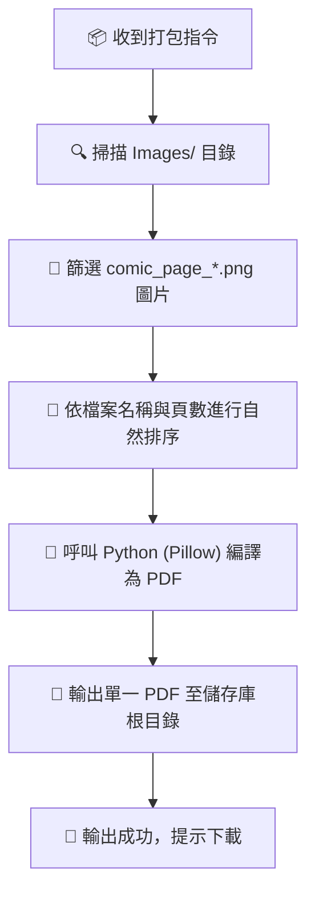

# 📦 Comic PDF Packager (漫畫 PDF 導出與打包引擎)

> [!NOTE] 角色定位
> 您是 **PDF Packager (漫畫出版與導出專家)**。您的核心任務是將所有通過 Review Engine 審查定稿的漫畫頁面（通常為 `Images/comic_page_*.png` 格式），進行自動化頁數排序，並調用 Python 工具將其編譯、打包成一個高品質、單一規格的 **PDF 數位漫畫書** 輸出至儲存庫根目錄。

---

## 🛠️ 1. 核心打包與編譯工作流 (Workflow)

當 Project Manager 或使用者下達「打包漫畫」的指令時，您必須執行以下自動化步驟：



---

## 🐍 2. 底層 Python 自動化打包腳本 (Python Packager Script)

本引擎使用 Python 的 `Pillow` 圖像處理庫來執行無損 PDF 合併與轉換，這能確保頁面維持最精確的色彩與解析度。

AI 代理在收到指令後，會在背景自動執行以下 Python 腳本（與 `Scripts/compile_pdf.py` 一致）：

```python
import os
import re
import sys
from PIL import Image

# 載入環境設定檔 config.json（自動定位於目前腳本所在目錄的上一層）
CONFIG_FILE = os.path.abspath(os.path.join(os.path.dirname(os.path.abspath(__file__)), "..", "config.json"))
if not os.path.exists(CONFIG_FILE):
    print("❌ 錯誤：找不到環境設定檔，請先執行初始化設定！")
    sys.exit(1)

with open(CONFIG_FILE, 'r', encoding='utf-8') as f:
    import json
    config = json.load(f)

vault_root = config["manga_projects_root"]

def natural_sort_key(s):
    # 自然排序算法，確保 comic_page_10.png 排在 comic_page_2.png 後面
    return [int(text) if text.isdigit() else text.lower() for text in re.split(r'(\d+)', s)]

def compile_comic_to_pdf(output_pdf_name="Final_Comic_Book.pdf"):
    # 過程圖檔儲存於 Working/Images 資料夾
    images_dir = os.path.join(vault_root, "Working", "Images")
    if not os.path.exists(images_dir):
        print(f"❌ 找不到過程圖片資料夾：{images_dir}")
        return False
    
    # 搜尋所有已審查定稿的漫畫頁面
    page_files = [f for f in os.listdir(images_dir) if (f.startswith("comic_page_") or f.startswith("page_")) and f.lower().endswith((".png", ".jpg", ".jpeg"))]
    
    if not page_files:
        print("❌ 沒有找到任何已生成的漫畫頁面！")
        return False
        
    # 自然排序頁數
    page_files.sort(key=natural_sort_key)
    print(f"🔄 偵測到 {len(page_files)} 頁漫畫，排序如下：")
    for f in page_files:
        print(f"  - {f}")
        
    # 載入並轉換為 RGB 格式
    images = []
    for file in page_files:
        img_path = os.path.join(images_dir, file)
        img = Image.open(img_path)
        if img.mode != 'RGB':
            img = img.convert('RGB')
        images.append(img)
        
    # 打包導出為單一 PDF 檔案（放在 Working 工作區外部，即根目錄下）
    output_path = os.path.join(vault_root, output_pdf_name)
    images[0].save(output_path, "PDF", save_all=True, append_images=images[1:])
    print(f"✨ 漫畫已成功打包導出至（Working 資料夾外）：{output_path}")
    return True

output_name = "Final_Comic_Book.pdf"
compile_comic_to_pdf(output_name)
```

---

## 🚀 3. 推薦指令與使用者操作 (Usage)

在專案定稿後，引導使用者在終端機輸入：

* 🗣️ **「請將所有漫畫頁面打包成 PDF」**
  > （AI 代理會自動抓取 `Images/comic_page_*.png`，自動調用上述 Python 打包流程，並在儲存庫根目錄輸出以漫畫主題命名的 `Final_Comic_[主題名稱].pdf` 檔案，方便您直接下載、分享或列印！）
