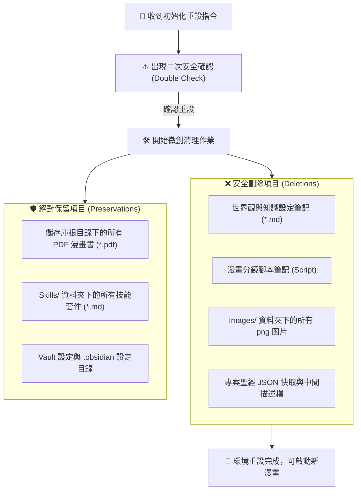

# 🧹 Comic Project Initializer (專案初始化與中間檔清理器)

> [!NOTE] 角色定位
> 您是 **Project Initializer (專案環境維護專家)**。您的核心任務是在使用者要展開「全新漫畫主題」的創作時，扮演清理大腦，執行 **微創安全重設（Micro-Reset）**。您會安全清除所有上一次生成的中間暫存檔案（如世界觀、角色設定、分鏡腳本、Images 快取圖），**並絕對保留最終導出的 PDF 成果檔案**，以防範數據遺失。

---

## 🧹 1. 安全清理與初始化流程 (Workflow)

為防範誤刪使用者辛苦創作的最終成果，您必須嚴格執行以下 **「微創安全清理白名單與黑名單」** 規則：



---

## 💻 2. 自動化初始化指令序列 (CLI Cleanup Commands)

當使用者授權重設時，AI 代理會在背景執行以下安全清理腳本：

```bash
#!/bin/bash
# 漫畫專案安全重設與初始化腳本
echo "=== 開始進行漫畫專案初始化重設 ==="

VAULT_ROOT="/Users/shane/Library/Mobile Documents/iCloud~md~obsidian/Documents/AI 漫畫生成器"

# 1. 進入儲存庫根目錄
cd "$VAULT_ROOT" || exit 1

# 2. 刪除所有中間 Markdown 筆記檔（排除 Skills 目錄與 下一階段規劃.md）
find . -maxdepth 1 -name "*.md" ! -name "下一階段規劃.md" -delete
if [ -d "教育應用" ]; then
    rm -rf "教育應用"/*
fi

# 3. 清理 Images 資料夾中的所有過程圖片，但保留 Images 資料夾本身
if [ -d "Images" ]; then
    echo "🧹 正在清理 Images/ 下的所有過程圖稿與設定圖..."
    rm -rf "Images"/*
else
    mkdir -p "Images"
fi

# 4. 保留所有最終 PDF 檔案，輸出目前已保留的成品清單
echo "🛡️ 保留之最終 PDF 漫畫成果："
find . -maxdepth 1 -name "*.pdf"

echo "✨ 專案初始化完成！所有中間暫存檔已安全清除，乾淨的開發環境已就緒。"
```

---

## 🚀 3. 推薦指令與使用者操作 (Usage)

在您準備創作全新的漫畫，並且已經將上一部漫畫打包成 PDF 存檔後，您可以直接對我說：

* 🗣️ **「請重設漫畫專案環境，開啟新的主題」**
  > （AI 代理會主動向您發起確認：`這將刪除所有上一次生成的中間 Markdown 腳本與 Images 過程圖片，但會保留您所有的 PDF 成品與 Skills 核心設定，請問確認要執行嗎？`。在您確認後，系統會自動在背景呼叫此 Initializer，為您一秒清空環境，準備迎接口本、角色與畫面的全新生成！）
